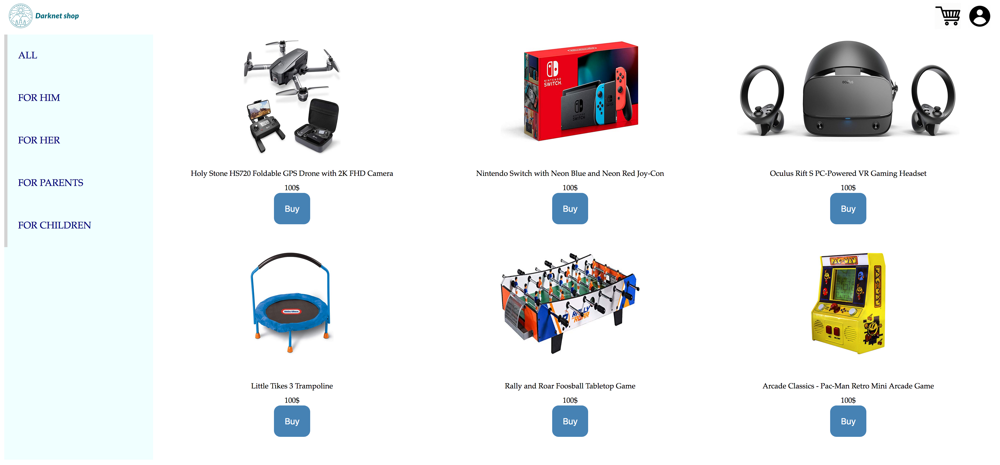

# Online shopping system

Simple online shopping system developed as part of PHP bootcamp within 16 hours.

### Steps to run the system

1. Install XAMPP or WAMPP.
2. Open XAMPP Control panel and start [Apache] and [MySQL] .
3. Download project from github (https://github.com/ytanne/ft_minishop).
4. Insert credentials of your database in php/dbmanipulate.php.
5. Run `php -f install.php && php -S localhost:8080` (*or any other port you wish).
6. Open localhost page in your browser to see the result.

### Short Description

The work that was done in this project:
1) Databases including all items were created.
2) User management and authentication was established.
3) Basket management was implemented to store and evaluate the total price of goods.
4) Simple landing page of e-commerce shop was build.

### Screenshot of landing page

Thanks for attention!

